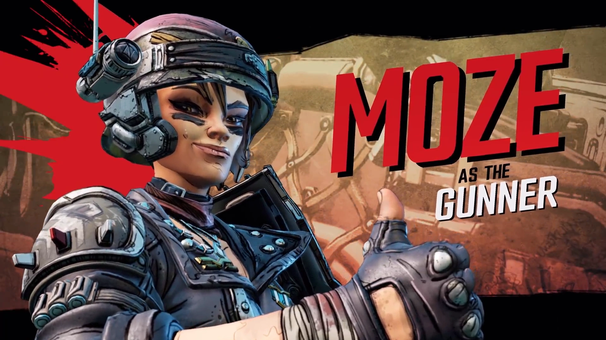

# Mozepository
A project in the vein of [LootLemon](https://www.lootlemon.com/class/moze#xxxx_0000000000000_0000000000000_0000000000000_0000000000000) but specifically for Moze! Also will provide access to a build creator w/ in-depth equipment, guardian rank, &amp; mayhem scaling.  

Designed for use in creating, saving, & experimenting with Moze builds for Borderlands 3.

## What is Mozepository?

<em> I'm Moserah Hayussinian Yan-Lun al-Amir Andreyevna. Call me Moze. </em> 

 

So, I've been playing Borderlands 3 lately. I've also tried out Mayhem mode and subsequently got my ass kicked on it, what gives? 

Turns out that my build was all wrong; apparently, you need *something something [Mindsweeper](https://borderlands.fandom.com/wiki/Mind_Sweeper) something something [Fire in the Skag Den](https://borderlands.fandom.com/wiki/Fire_in_the_Skag_Den)* but I obviously didn't know that! Part of this is because I didn't know how strongly skills are scaled with Mayhem and another was because I didn't even know this class mod existed - as such, I decided to make a small resource for experimenting w/ different Moze builds across gear, skills, & other factors affecting scaling.

## Planned Features
1. **A skill calculator for Moze's four skills trees**, similar to that of LootLemon.
2. **A repository for different weapons, shields, class mods, relics, & grenades**. Also similar to that of LootLemon. 
- Currently, I am only planning on doing *unique items* - that is to say red text gear.
3. **A loadout menu, where you can save & create different loadouts for Moze**. Factors in gear, skills, mayhem modifiers, and guardian rank.
> On this page, stats will be displayed showing weapon's DPS across different elements & how your build & game affects your damage output. This is meant to be in the same vein as the *STATUS* menu from Nioh 2 that showsall of the stats currently boosting your character.

## TODO
1. Fix skill trees to include icons
2. Fix skill trees to scale description depending on point investment

## Resources
- HUGE shoutout to [LootLemon](https://www.lootlemon.com/class/moze#xxxx_0000000000000_0000000000000_0000000000000_0000000000000) for the motivation & framework for the this project! This was what originally got me interested in making my own builds.
- Another shoutout to the [Borderlands Wiki](https://borderlands.fandom.com/wiki/Borderlands_Wiki) for sourcing information on gear, drops, & stats - wouldn't be possible without them!